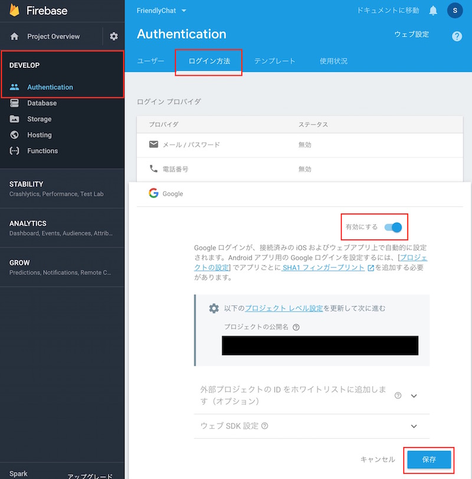

# Firebase Web

[Firebase Web Codelab](https://codelabs.developers.google.com/codelabs/firebase-web/#0)

Firebaseを使用してチャットクライアントを実装する。主な実装内容は以下の通り。

- Firebase Realtime DatabaseとCloud Storageを使用してデータを同期する。
- Firebase Authを使用してユーザを認証する。
- Firebase静的ホスティングにWebアプリケーションをデプロイする。
- Firebase Cloud Messagingで通知を送信する。

### MEMO

#### 認証

##### Enable Google Auth

ユーザーがウェブアプリにサインインできるようにするには、Google認証を有効にする必要がある。

1. Firebase ConsoleでDEVELOPセクション> Authentication> SIGN IN METHOD（ログイン方法）タブを開く。
1. Google Sign-in Providerを有効にしてSAVE（保存）をクリックする。



これにより、ユーザーは自分のGoogleアカウントでWebアプリケーションにサインインできる。

##### Enable Cloud Storage
クラウドストレージを使用して写真をアップロードするために、Cloud Storageを有効にする必要がある。

1. Storageセクションにアクセスし、Get Started（スタートガイド）ボタンをクリックする。
1. セキュリティルールに関する免責条項を受け取ったら、OKをクリックする。

>デフォルトのルールでは、すべての読み取りと書き込みが許可されます。データ構造を定義した後で、アプリに固有のデータを保護するためのルールを作成する必要があります。

```
service firebase.storage {
  match /b/{bucket}/o {
    match /{allPaths=**} {
      allow read, write: if request.auth != null;
    }
  }
}
```

#### Firebase Command Line Interfaceのインストール

```
npm -g install firebase-tools

```

以下のコマンドでFirebase CLIを認証する。

```
firebase login
```

ブラウザが開いて認証を求められるので、許可すると認証完了。

以下のコマンドで1つのプロジェクトに複数の環境を構築できる（「エイリアスを作成、追加する」とも言う）。

```
firebase use --add
```

コマンド入力後、環境名の入力を求められるが"development"、"staging"、"production" といった別名をつけるのが一般的である。これを利用すれば、本番用、開発用などの複数の環境の構築、操作が簡単にできる。

環境（エイリアス）は以下のように切り替えができる。

```bash
# デフォルトという名前のエイリアスを現在の環境にする
firebase use default

# ステージングという名前のエイリアスを現在の環境にする
firebase use staging
```

#### Database Security Rules
Firebase Realtime Database ルールでは、データベースへの読み取り / 書き込みアクセス権を持つユーザー、データが構造化される仕組み、存在するインデックスを決定する。

デフォルトで設定されるルールの制限によって、データベースに対する読み取りと書き込みが完全にできるのは、認証ユーザーだけである。これによってデータベースは不正行為から保護される。

ルールはカスタマイズできる。今回は`database-rules.json`という設定ファイルを追加する。

```json
{
  "rules": {
    "messages": {
      ".read": "auth !== null",
      ".write": "auth !== null"
    },
    "fcmTokens": {
      "$token": {
        // ユーザーは自分のデバイストークンだけ読み取りができる
        ".read": "data.val() === auth.uid",
        // ユーザーは自分のデバイストークンだけ書き込みができる
        ".write": "!data.exists() || data.val() === auth.uid",
        // 値はユーザーのUIDでなければならない
        ".validate": "newData.val() === auth.uid"
      }
    }
  }
}
```

`auth.uid`などの`auth`変数は、認証されたユーザーに関する情報を含む特別な変数。`uid`はFirebase Authentication によって取得されたユーザーのID。

`firebase.json`の`database.rules`属性に`database-rules.json`を追加することにより、カスタムルールが有効になる。

```json
{
  "database": {
    "rules": "database-rules.json"
  },
  "hosting": {
    "public": "./",
    "ignore": [
      "firebase.json",
      "database-rules.json",
      "storage.rules"
    ]
  }
}
```

Firebase CLIを使用してこれらのルールを展開するには以下のコマンドを実行する。

```bash
firebase deploy --only database
```

`firebase deploy`は以下のデプロイを行える。

- Firebase Hosting サイトの新規リリース
- 新規または既存の Cloud Functions
- Firebase Realtime Database のルール
- Cloud Storage のルール
- Cloud Firestore のルール
- Cloud Firestore のインデックス

`firebase deploy`で全てデプロイされる。

**デプロイするにはプロジェクトディレクトリに`firebase.json`が置かれている必要がある**。